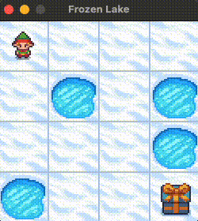

# OpenAI Frozen Lake Gym Environment 🧊

> Gym environment solving the Frozen Lake problem using Q-Learning.

## Results



> [!TIP]
> To train the model faster, comment the `env.render(mode='human')` call in `bin/agent.py` or change the `render_interval` variable as desired.

### Epoch reward tracker


## TODOs

- [x] Train the agent using Q-Learning
- [ ] Save the model to be reused with a library like [stable-baselines](https://stable-baselines3.readthedocs.io/en/master/)

## Running

To run the gym environment first create a new Python environment and activate it. I'm using [Anaconda](https://www.anaconda.com/) for setting the python version that pipenv should use to set up the environment. The command bellow will automatically setup the environment with conda and pipenv:

```shell
make env
```

Now install all the project dependencies:

```shell
make install-all
```

To run the game to be played by a human run (use arrows <, ^, >, v):

```shell
make play
```

> [!WARNING]
> Since FrozenLake doesn't have a NoOP action, the default will always be `0`.
> Which means that when playing it will always go to the left. Try pressing
> the arrows faster to bypass that.

To run the game and run random actions run:

```shell
make sample
```

To run the agent to complete the game task run:

```shell
make agent
```
